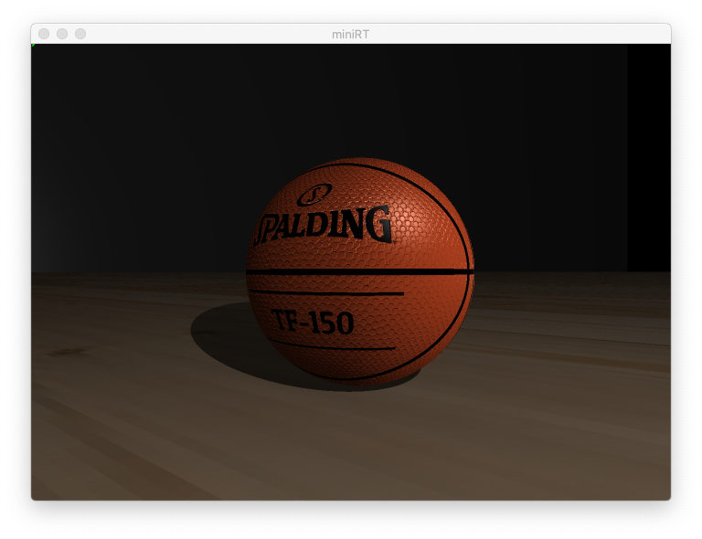

# :flashlight: miniRT

> 👉 A small ray tracing engine written in C from scratch!



--- 

## :wrench: BASIC INSTRUCTIONS

First of all you must compile the project:
``` bash
make #basic functionalities
make bonus #advance features such as texture handling and more!
``` 
For basic operation you must execute: `./miniRT "path_scene" --[options]` when compiling with `make`.

When compiling with `make bonus` you must execute `./miniRT_bonus "path_scene" --[options]`.

You can **move inside a scene** with the following controls:

Zoom | Translation | Change camera | Rotation
--- | --- | ---
**Q** : Zoom in | **W** : Move up | **Arrow left** : Previous camera | **Mouse** : Click on the desire direction you want the camera to look at. 
**E** : Zoom out | **S** : Move down | **Arrow right** : next camera
 | **A** : Move left
 | **D** : Move right

> :warning: _**Warning:** Since no bounding box or other performance algorithms are implemented movement isn't smooth in most cases since the program ray trace over and over again each frame. The purpose of this implementation was to allow the user to get the desired view quickly_ 
---
## :helicopter: OPTIONS
When executing the program you can add some extra flags which will add more value to your scenes such as color filtering, lighting effects or drawing a reference set of axis.

### Standard options:
For the standard compilation you can output rendered scenes in a .bmp file. (You can also do this with bonus option)
``` bash
--save #save rendered scene in a .bmp file. Scene will be output in ./output_bmp folder
```


### Bonus options:
When compiling with the `bonus`rule you will get a lot more options
```bash
 --help #invoke help menu inside terminal
--sepia-filter #add a sepia filter to rendered image 
--antialiasing #apply aliased effect to rendered image
--no-specular #removes specular light effect which comes from default
--reference-axis #draws a set of global reference axis
``` 

## :city_sunset: SCENES
A scene is the file where all information is readen from. Ambience, light sources, geometries, textures etc. will be defined here and readen by the program. The extension of this file is custom: `.rt`. This is an example of a scene with a few geomtries. As you can see you will define parameters such as screen resolution, RGB colors, positions and normal vectors:

```
R 500 500
A 0.3 255,255,255

c -80,0,5 1,0,0 45
c  80,0,5 -1.0,0,0 45
l -40,0,30 0.3 255,0,255

sp 0,0,10 30 255,255,0
cy 0,0,-15 0,0,1 20 17 255,255,255
pl 0,0,-20 0,0,1 255,255,255
tr 0,20,-10 -20,0,-10 10,0,-10 100,255,255
```

Aside from the standard configuration you can add some extra features which are listed, depending on the element.

#### :flashlight: LIGHT FLAGS
Add parallel light following a precise direction:
```bash
#Example:
l -20,0,5 0.7 255,255,255 parallel:1,0,0
```
#### :triangular_ruler: PLANE/TRIANGLE/SQUARE FLAGS

___Color disruptions:___

> All texture/bump images must have `.xpm`extension to work.

Handle planar textures:
```bash    
#Example:
pl 0,0,-30 0,0,1 255,255,255 skybox:textures/skybox.xpm
```
Add a checkered pattern:
```bash
#Example:
pl 0,0,-30 0,0,1 255,255,255 checkered
```
___Normal disruptions___

Add a normal disruption damped wave effect: 
```bash
#Example:
pl 0,0,-30 0,0,1 255,255,255 normal-disruption
```
Handle bumpmap textures:
```bash
#Example:
pl 0,0,-30 0,0,1 255,255,255 bumpmap:texture/example.xpm
```

#### :basketball: SPHERE

___Color disruptions:___

Add a color disruption rainbow effect depending on surface normal:
```bash
#Example:
sp 0,0,0 20 255,255,255 rainbow
```
Handle sphere textures:
```bash
#Example:
sp 0,0,0 20 255,255,255 uv-map:texture/earth.xpm
```

___Normal disruptions:___

Add a normal disruption damped wave effect:
```bash    
#Example:
sp 0,0,-30 0,0,1 255,255,255 normal-disruption
```
Handle bumpmap textures: 
```bash
#handle bumpmap textures. Example:
sp 0,0,-30 0,0,1 255,255,255 bumpmap:texture/example.xpm
```
#### :straight_ruler: CYLINDER

___Color disruptions:___

Add a color disruption rainbow effect depending on surface normal:
```bash
#Example:
cy 0,0,0 20 255,255,255 rainbow
```


### Some considerations

- In order to include these options/effects, you should add one or more of the following flags to the scene config file.

- Each vector is presented as an example, you can substitute with your own.

- Each texture/image file is presented as an example, you can substitute with your own. Path must be taken from the root of this proyect.

- Each geometry can combine one option from each category: color or normal disruption. These options should be written one after oother with one space between each.
